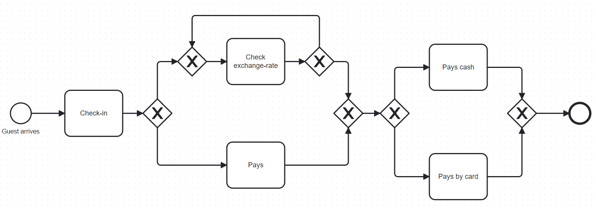

# advanced-process-mining

This is the repository for Group 5's Advanced Process Mining project in FSS24.

## Direct replication
Based on the instructions that can be found in the `README.md` in the `edt-ts` folder, i.e., the code of the original study, we first conducted a direct replication of their approach. Hereby, we note that for us, the author's instructions only worked when we installed the required dependencies via pipenv rather than trying to install the listed requirements directly via pip. 

To replicate the described baseline by the authors, we created the notebook `baseline.ipynb`. To execute it, the requirements need to be installed via:

```bash
pip install -r requirements.txt
```

## Conceptual replication
We then tried to conduct a conceptual replication on two artificial datasets that we created specifically for this project. The code for the data generation can be found in `generate.ipynb`. Our created datasets can be found in `edt-ts/data/group5_checkin.csv` and `edt-ts/data/group5_checkin_random.csv`. For the conceptual replication, we directly used the code from the original authors in the folder `edt-ts`. To execute the python notebooks that we created for data generation, you also need to install the requirements as specified in the requirements.txt via 

```bash
pip install -r requirements.txt
```

In accordance with the code from the original authors, we used Python version 3.9.6 for our data generation notebook.

## Artificial process model
For the conceptual replication, we generated an artificial data based on the following process model:



The model describes a process that happens in a hotel when a foreign tourist arrives, who has to exchange money to pay for his stay. If the tourist doesn't have (enough) cash in the required currency yet, he will check the exchange rate 10 times to see whether it makes sense to exchange money at the given moment. If so, he withdraws money and pays the hotel. If not, he pays by card, using the pre-defined exchange rate of 1-1.